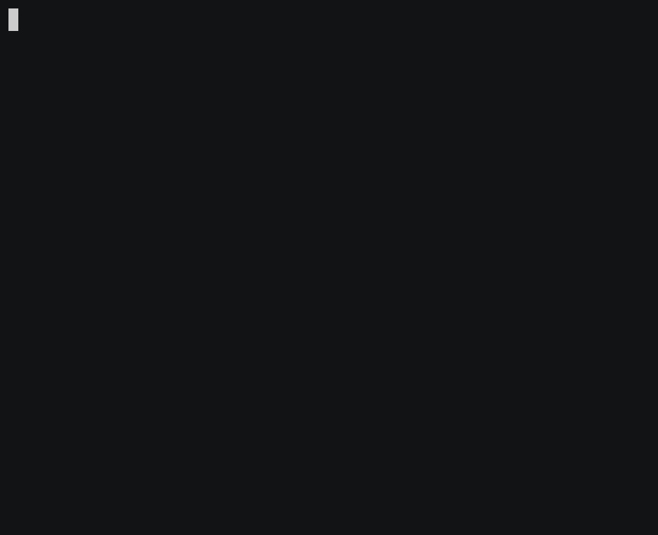
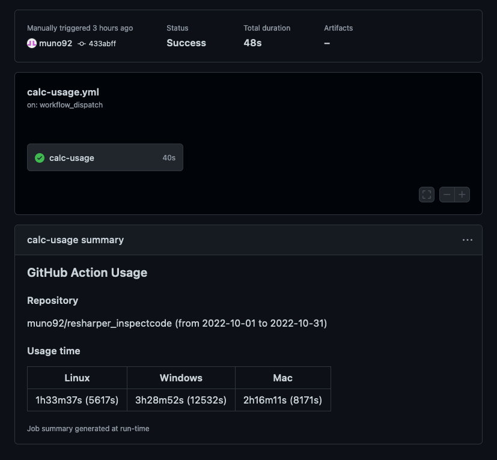

# GitHub Actions Usage Calculator

[](https://github.com/muno92/gha-usage/actions/workflows/test.yml)

This tool calculate GitHub Actions usage with specified repository and period.  



You can choose between GitHub Actions and Command Line to exec this tool.

## Usage

> **Warning**  
> This tool can only calculate the usage of less than 1000 workflow runs  
> (due to GitHub REST API limitations).  
> So, please change period by workflow run count.

You can see workflow run count with follow command.

```bash
./ghausage count --repo REPO --start START_DATE --end END_DATE
# example)
./ghausage count --repo muno92/gha-usage --start 2022-11-01 --end 2022-11-30
```

### GitHub Actions

From GitHub Actions, gha-usage output result to Job Summary.



#### Inputs

- repo (**required**)  
  The name of target repository.  
  example) muno92/gha-usage
- start-date (**required**)  
  Start date of calculation period with format 'yyyy-mm-dd'.  
  example) 2022-01-01
- end-date (**required**)  
  Start date of calculation period with format 'yyyy-mm-dd'.  
  example) 2022-01-31

#### Example) Get usage of last month

```yaml
name: Calculate usage

on:
  schedule:
    - cron:  '5 0 1 * *'
    
jobs:
  calc-usage:
    runs-on: ubuntu-latest
    steps:
      - name: Set Start Date
        run: echo "START_DATE=$(date -d "$(date +'%Y%m01') 1 month ago" +'%Y-%m-%d')" >> $GITHUB_ENV
      - name: Set End Date
        run: echo "END_DATE=$(date -d "$(date +'%Y%m01') 1 days ago" +'%Y-%m-%d')" >> $GITHUB_ENV
      - uses: muno92/gha-usage@v0.1.0
        with:
          repo: ${{ github.repository }}
          start-date: ${{ env.START_DATE }}
          end-date: ${{ env.END_DATE }}
        env:
          GITHUB_TOKEN: ${{ secrets.GITHUB_TOKEN }}
```

#### Example) Get usage of last week

```yaml
name: Calculate usage

on:
  schedule:
    - cron:  '5 0 * * 0'
    
jobs:
  calc-usage:
    runs-on: ubuntu-latest
    steps:
      - name: Set Start Date
        run: echo "START_DATE=$(date -d '8 days ago' +'%Y-%m-%d')" >> $GITHUB_ENV
      - name: Set End Date
        run: echo "END_DATE=$(date -d '1 days ago' +'%Y-%m-%d')" >> $GITHUB_ENV
      - uses: muno92/gha-usage@v0.1.0
        with:
          repo: ${{ github.repository }}
          start-date: ${{ env.START_DATE }}
          end-date: ${{ env.END_DATE }}
        env:
          GITHUB_TOKEN: ${{ secrets.GITHUB_TOKEN }}
```

### Command Line

1. Download binary from [release](https://github.com/muno92/gha-usage/releases) page.
2. Creating a [personal access token](https://docs.github.com/ja/authentication/keeping-your-account-and-data-secure/creating-a-personal-access-token).  
  When target repository is public, token needs no permission, because token is only for avoid [rate limit](https://docs.github.com/en/rest/overview/resources-in-the-rest-api#rate-limiting).
3. Exec gha-usage  
   ```bash
   export GITHUB_TOKEN=YOUR_TOKEN
   ./ghausage sum --repo REPO --start START_DATE --end END_DATE
   # example)
   ./ghausage sum --repo muno92/gha-usage --start 2022-11-01 --end 2022-11-30
   ```
